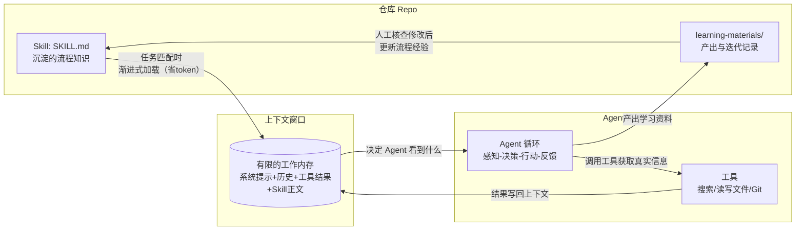

# 概念关系说明：上下文、Agent 与 Skill

> 本文由项目级 Skill「concept-study-guide」生成草稿，经人工核查修改后定稿。
> 配套可视化版本见同目录 `concept-relationship.html`。
> 单个概念的详细学习资料见 `agent.html`、`llm-context.html`、`skill.html`。

## 一、一句话概括三者关系

**上下文是资源，Agent 是消耗资源完成任务的系统，Skill 是往资源里"精装"可复用知识的机制。**

- 上下文窗口：模型一次能"看到"的全部材料，是有上限的稀缺资源。
- Agent：围绕模型搭的"感知—决策—行动—反馈"循环，每转一圈都读写上下文。
- Skill：把重复任务的经验写进文件、按需加载进上下文的沉淀机制。

## 二、关系对照表

| 维度 | 上下文（Context） | Agent | Skill |
|---|---|---|---|
| 本质 | 模型单次请求可见的信息空间及其上限 | 模型 + 工具 + 自主循环构成的系统 | 结构化的任务知识文档（SKILL.md） |
| 存在形式 | token 序列，一次性，随请求消失 | 长期运行的软件系统 | 仓库里的文件，可版本管理 |
| 解决的问题 | 让模型"看到"该看的信息 | 让模型能"动手"完成多步任务 | 让好做法"写一次、处处复用" |
| 相互作用 | 是 Agent 的工作内存；是 Skill 的加载目标 | 消耗上下文资源；需要 Skill 提供流程规范 | 把知识注入上下文；约束 Agent 的行为 |

## 三、上下文如何影响 Agent 的工作（重点一）

Agent 的每一步都会产生写入上下文的痕迹——工具返回的结果、中间推理、用户补充。因此上下文直接决定 Agent 的三个表现：

1. **决定"知道什么"**：Agent 只能基于当前窗口内容决策。工具查到的信息进了上下文它才知道；没进（或被截断）它就"失明"。多步任务失败的第一嫌疑人是"关键信息不在窗口里"。
2. **决定"能干多久"**：窗口有限，长任务中旧信息会被截断或压缩，Agent 可能"忘掉"最初目标。所以成熟的 Agent 系统要做上下文管理：压缩摘要、把长结果写入外部文件、只回读必要部分（Anthropic 称上下文为 Agent 最稀缺的资源）。
3. **决定"干得多准"**：实验（Lost in the Middle, TACL 2023）表明模型对窗口中部的信息利用率下降。把关键指令放在开头或结尾、剔除无关信息，能直接提升 Agent 的表现——这就是"上下文工程"在 Agent 场景的落点。

## 四、Skill 如何沉淀可复用的任务知识（重点二）

1. **从"每次交代"到"一次沉淀"**：没有 Skill 时，做同类任务每次都要重复写一遍要求；Skill 把这些要求写成 SKILL.md 放进仓库，通过 Git 还能持续迭代。
2. **按需注入，不占窗口**：Skill 的元数据（name + description）只占几十 token 常驻上下文；正文仅在任务匹配时加载。这是对"上下文稀缺"的直接回应——用渐进式加载换取知识容量。
3. **给 Agent 装上"操作规程"**：Agent 的自主决策能力 + Skill 的固定流程 = 既灵活又不跑偏。本仓库的 practice：Agent 负责检索、核验、生成，concept-study-guide Skill 规定九节结构、来源核验规则和自检清单。
4. **团队/个人资产化**：Skill 是纯文本、可进版本库、可分享，本质是"把个人经验变成工程资产"，与代码复用的思想一脉相承。

## 五、整体流程图（Mermaid）

图中闭环值得注意：产出（learning-materials）经人工核查后，新的经验又回流进 Skill——Skill 不是写完就死的文档，而是随使用持续演进的活知识。

## 六、我的个人判断（个人理解部分）

我的判断是：这三个概念其实是同一件事的三个层次——上下文回答"信息从哪来"，Agent 回答"怎么持续行动"，Skill 回答"经验怎么不流失"。它们之间有依赖顺序：不理解上下文是有上限的资源，就看不出 Skill 为什么要做成渐进式加载；不理解 Agent 会自主决定步骤，就看不出 Skill 里为什么必须写自检和边界。

其中我认为最值得记住、也最反直觉的一点是：**上下文不是"越大越好"的免费资源，它更像内存**——塞什么、先塞什么、什么时候清掉，都是要设计的事。想明白这一点之后，我再看那些复杂的 Agent 框架，会发现它们很大一部分工作其实都在做同一件事：管好那张"桌面"。而 Skill 就是往这张桌面上放东西的一种最省地方的写法：平时几乎不占位置，需要时才翻开。

（本段为我本人改写的口语版笔记；HTML 版见 `concept-relationship.html`。）
